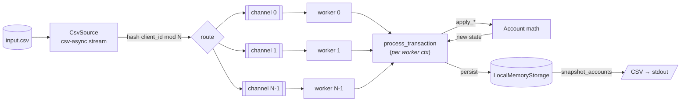

# csv-ingestor

A Rust workspace that ingests a CSV of client transactions (deposits,
withdrawals, disputes, resolves, chargebacks), applies the dispute lifecycle
to per-client accounts, and emits final account state as CSV on stdout. The
ingest pipeline is async and parallelised across N workers, with each client's
traffic pinned to one worker via modulo-hash partitioning so no two workers
ever touch the same account concurrently.

Built on Rust 1.95, tokio, csv-async, and rust_decimal. Hexagonal architecture
— pluggable sources and storage adapters behind narrow ports.

```bash
cargo run -p cli -- transactions.csv > accounts.csv
cargo run -p cli -- transactions.csv --tracing --log-level debug
cargo test --workspace
```

## Folder structure

```
csv-ingestor/
├── Cargo.toml                        # workspace manifest
├── rust-toolchain.toml               # pinned to 1.95
├── .gitignore                        # Rust-specific
├── .vscode/launch.json               # debug configs (cli, integration tests, unit tests)
└── scripts/                          # helper scripts for things like generating test data
└── crates/
    ├── cli/                          # binary entry point
    │   ├── Cargo.toml
    │   └── src/
    │       ├── lib.rs                # cli::run / run_from_args, CSV output
    │       └── main.rs               # #[tokio::main] entry
    │
    ├── transaction-processor/        # the library doing the actual work
    │   ├── Cargo.toml
    │   └── src/
    │       ├── lib.rs                # crate-root re-exports
    │       ├── domain.rs             # Transaction, TxType, Account + apply_*,
    │       │                         #   ProcessorSoftFailures + Account unit tests
    │       ├── ports.rs              # Source / Storage traits, TransactionError
    │       ├── processor.rs          # TransactionProcessor, ProcessOutcome,
    │       │                         #   worker_loop, process_transaction (orchestration)
    │       ├── sources/
    │       │   ├── mod.rs            # route(client_id, parallelism) fn
    │       │   └── csv_source.rs     # csv-async streaming inbound adapter
    │       └── storage/
    │           ├── mod.rs
    │           └── local_memory.rs   # in-memory outbound adapter
    │
    └── tests/                        # cross-crate integration tests
        ├── Cargo.toml
        ├── src/
        │   ├── lib.rs
        │   └── metrics.rs            # MetricsGuard: elapsed time + peak heap
        └── tests/integration.rs      # drives cli + transaction-processor end-to-end
```

## Architecture

The processor follows a hexagonal (ports + adapters) layout. Dependency
direction:

```
domain  ← ports  ← processor  ← adapters (sources, storage)
                       ↑
                     cli
```

- **`domain`** — leaf module. `Transaction`, `TxType`, `Account`, and the soft-
  failure vocabulary (`ProcessorSoftFailures`). Pure data + per-account
  arithmetic on `Account::apply_{deposit,withdrawal,dispute,resolve,chargeback}`.
  No async, no I/O, no awareness of storage.
- **`ports`** — the `Source` and `Storage` traits, plus `TransactionError`
  (the error vocabulary genuine storage faults speak). Depends only on
  `domain`.
- **`processor`** — the application core. Owns the worker pool, the bounded
  channels, the consistent-hash router, and `process_transaction` (orchestration
  only — all balance math is delegated to `Account::apply_*`). Defines
  `ProcessOutcome` (`Applied` / `SoftFailed(reason)`).
- **Adapters** — `sources::csv_source::CsvSource` implements `Source` (reads
  CSV via `csv-async`); `storage::local_memory::LocalMemoryStorage` implements
  `Storage` (in-memory `HashMap`s under sync mutexes, plus a `HashSet<u32>` of
  processed tx_ids for O(1) dedup).

### Transaction's journey



1. **Read.** `CsvSource` opens the file and streams rows asynchronously via
   `csv-async`. Each row is deserialized into a `CsvTransaction` and converted
   into the internal `Transaction`. Malformed rows (bad type, missing fields,
   uneven column counts) are logged and skipped without aborting the stream.
2. **Route.** The source hashes `tx.client_id` and takes it mod N (the
   configured parallelism, defaults to `num_cpus::get()`). The result selects
   one of N bounded mpsc channels. Because every transaction for a given client
   hashes to the same channel, all of that client's traffic is serialised
   through one worker — no concurrent mutation of one account.
3. **Process.** Each worker is a `tokio` task running `worker_loop`, which
   pulls from its channel and calls `process_transaction`. Orchestration steps:
    - dedup monetary tx_ids via `Storage::has_transaction_been_processed`
    - fetch the current `Account` via `Storage::get_account`
    - for lifecycle events (dispute/resolve/chargeback): look up the
      referenced tx via `find_transaction` / `find_disputed_transaction` and
      validate `client_id` and (for disputes) that the target is a deposit
    - delegate the actual balance update to `Account::apply_*`
    - persist via the matching `Storage::update_account_for_*`
4. **Outcome.** `process_transaction` returns
   `Result<ProcessOutcome, anyhow::Error>`:
    - `Ok(Applied)` — state was mutated.
    - `Ok(SoftFailed(reason))` — valid business no-op (negative amount,
      insufficient funds, locked account, missing tx_id, client mismatch,
      duplicate). Logged at `debug`.
    - `Err(_)` — genuine fault (storage I/O failure or violated invariant).
      The worker logs at `error` and panics — fail fast.
5. **Output.** After the source finishes, `cli::run` calls
   `processor.shutdown()` to drop the senders and join the workers, then pages
   through `snapshot_accounts(page, page_size)` and writes
   `client,available,held,total,locked` rows to stdout.

## Notes / known issues / future work

Known to be open or worth revisiting later.

### Open issues acknowledged at time of writing (or not yet done)

- **Storage atomicity.** `LocalMemoryStorage::update_account_for_dispute`
  (and friends) acquire the `accounts` mutex, release it, then acquire the
  transaction-map mutex. A failure between the two leaves account state
  mutated and the transaction not transferred. However, for local_memory
  storage, the failures between are very unlikely. You could wrap everything
  in a mutex, but then you'd also want to do the first bullet in the out of
  scope section below, so that you avoid contention.
- **`ProcessorSoftFailures` naming.** The type lives in `domain.rs` (because
  `Account::apply_*` produces it) but the prefix suggests it's processor
  vocabulary. Rename to `SoftFailure` or `TransactionFailure` for hygiene.
- **CSV format mismatches.** Malformed rows are silently logged at `debug`;
  large input files with a known-bad pattern produce a wall of log lines.
  A counter + single summary on EOF would be friendlier. However, if you
  do not enable tracing on the cli, it's disabled by default, so you won't
  see anything.
- **Contention in local memory storage** Leveraging the shards to avoid contention
  in the storage implementations is still yet to be done. I chose not to implement
  that in the local_memory storage due to the additional complexity it would add.
  Implementation would be fairly straight forward, as you would just need to pass
  the shard/worker id through to the storage calls, so that it could work on a set
  of data lock and contention free :) The part that would need to change is the 
  pagination routine after ingest of the csv is complete and we want to output the
  client accounts. Today that is a simple lookup, but we would need to use 
  something like an encoded cursor to know which shard and position in the shard 
  we're in.
- **CSV reader can be blocked** Today, if someone adds another storage impl, and it 
  incurs high latency times for operations, then that'll cause backpressure on the
  worker channels, which, if the incoming data has a set of clients that are all
  going to the same shard, then the reader would essentially stall until there's
  room in that channel again. Two options are to either increase the backpressure
  limit (I don't recommend it), or implement a multi-ptr routine to continue reading
  at multiple points and come back later.


